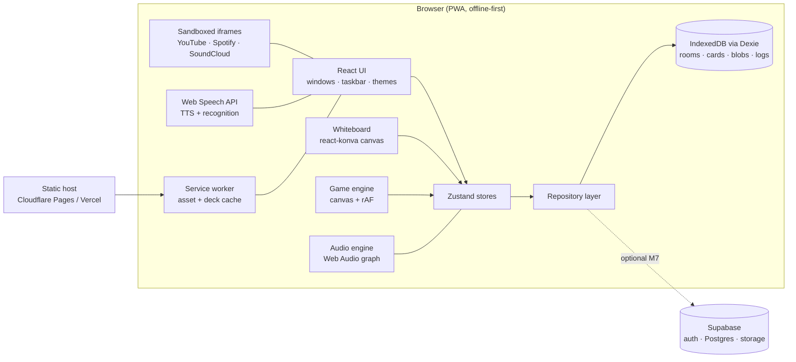

# Lernzimmer — System Design

> A cozy pixel study room for learning German. You decorate your own room: a whiteboard, stickers,
> a clock, music, rain on the window. Then you study inside it with flashcards, mini games and focus timers.

Status: **M2 (whiteboard) done.** This document is the spec that later milestones build against.

---

## 1. Product vision

| Pillar | Meaning |
|---|---|
| **A place, not a course** | The home screen is *your room*, not a lesson list. People come back to a place they built. |
| **Pixel OS feel** | UI looks like a retro desktop (reference 2: "aconite"): draggable windows, a start menu (`ITEMS / SAVE / SYSTEM / END`), a status bar with a timer. |
| **Learning inside play** | Every widget can teach something. The clock asks *"Wie spät ist es?"*, stickers can become flashcards, the pet only eats if you review. |
| **Local-first** | Works offline with no account. Everything is saved in the browser (IndexedDB). Cloud sync is optional and comes later. |
| **Vietnamese-friendly** | UI in 🇻🇳 Vietnamese / 🇬🇧 English / 🇩🇪 German. Grammar explanations compare German with Vietnamese where that helps (for example, Vietnamese has no grammatical gender or case). |

### Target user
A Vietnamese learner (A0–B2) studying for Goethe/telc exams, Ausbildung, or university in Germany. They study in long sessions with music and ambient sound and like to personalise their space (think Notion aesthetic, lofi girl, Animal Crossing).

---

## 2. Visual language

### 2.1 Three themes (from the reference images)

| Theme | Source | Mood | Used for |
|---|---|---|---|
| `aquarium` | Ref 1: underwater bar | deep navy + neon cyan, glowing bulbs, bubbles | night study, focus mode |
| `aconite` | Ref 2: retro OS window | cream paper + cobalt blue Win95 chrome | default day theme, whiteboard |
| `violet` | Ref 3: Undertale dating UI | pure black + violet + white pixel type | games, arcade, boss fights |

Players can switch themes at any time. Each room remembers its own theme.

### 2.2 Master palette `pd17`
All sprites use one shared palette so themes can recolor them with palette-swap shaders or CSS filters.

| Key | Hex | Role | | Key | Hex | Role |
|---|---|---|---|---|---|---|
| `k` | `#0d0b1e` | outline / ink | | `r` | `#e0344a` | **die** (feminine), danger |
| `w` | `#f4efe6` | cream / paper | | `o` | `#ff8a2a` | fire, warning |
| `g` | `#8b8aa3` | grey | | `y` | `#ffd23f` | gold, XP, highlight |
| `d` | `#3b3857` | dark grey-violet | | `e` | `#3fbf6a` | **das** (neuter), success |
| `b` | `#1f4fd1` | cobalt, **der** (masculine) | | `f` | `#1f6b3a` | dark green |
| `c` | `#3fd0ff` | neon cyan | | `t` | `#8a5a2b` | wood / brown |
| `n` | `#0a1a4a` | navy | | `s` | `#d9a066` | tan / pretzel / skin |
| `p` | `#8b5cf6` | violet | | `m` | `#ff9ecb` | pink |
| `v` | `#4c2a9e` | deep violet | | `.` | — | transparent |

**Gender colour coding, used everywhere:** `der` = blue, `die` = red, `das` = green, plural `die (Pl.)` = yellow.
This is the most important learning affordance in the whole UI, so it must stay consistent in cards, games, stickers and the whiteboard pens.

### 2.3 Typography
| Use | Font | Why |
|---|---|---|
| Headings / logo | **Press Start 2P** | chunky 8-bit, matches ref 3 |
| Body / UI | **VT323** | readable terminal font, includes Vietnamese diacritics |
| Small labels | **Silkscreen** | tiny caps like ref 3's "KIND · WISE · LOYAL" |
| Fallback for ä ö ü ß ẞ + tiếng Việt | **Pixelify Sans** / system mono | Check glyph coverage in M1 |

Fonts are installed via `@fontsource/*` npm packages (self-hosted, no Google CDN calls, GDPR-friendly).

### 2.4 Pixel rules
1. **Integer scaling only.** Base unit is 1 art pixel = `--px` CSS px (2, 3 or 4, chosen by viewport). Everything snaps to that grid.
2. `image-rendering: pixelated` on every sprite and canvas. No smoothing, no sub-pixel transforms.
3. Borders are 2 art pixels. Corners are "notched" (1 px cut), never `border-radius`.
4. Shadows are hard offsets (`4px 4px 0`), never blurred. The one exception is **glow** in `aquarium` (bulbs, neon).
5. Animations use `steps()` timing or sprite frames at 6–12 fps. There is no easing on pixel positions.
6. 9-slice panels (`panel_*` sprites) are used for all windows, cards and dialog boxes.
7. Dialog text types out character by character with a blip sound (Undertale style, ref 3's "✱ It's a beautiful day…").

### 2.5 Design tokens (CSS custom properties, per theme)
```css
:root[data-theme="aconite"] {
  --bg: #f4efe6; --surface: #fffaf0; --ink: #0d0b1e; --chrome: #1f4fd1;
  --accent: #3fd0ff; --muted: #8b8aa3; --shadow: 4px 4px 0 #0d0b1e;
  --font-head: "Press Start 2P"; --font-body: "VT323"; --px: 3px;
  --der: #1f4fd1; --die: #e0344a; --das: #3fbf6a; --plural: #ffd23f;
}
```

---

## 3. Information architecture

```
┌──────────────────────────────────────────────────────────────────┐
│ [♥ Lernzimmer]  Raum ▾   Deck: A1 Alltag   🔥 12   ⭐ 340 XP  ☾ │ ← top bar
├──────────────────────────────────────────────────────────────────┤
│                                                                  │
│    ROOM  =  infinite whiteboard canvas  +  background image      │
│    ┌─────────┐   ┌───────────────┐        ┌──────────┐           │
│    │ 🕐 Uhr  │   │ sticky: "der  │  📌    │ ♪ Radio  │  widgets  │
│    └─────────┘   │  Tisch 🟦"    │        └──────────┘  live ON  │
│         🥨 sticker └───────────────┘   ✏️ drawings       the board │
│                                                                  │
│    ┌─ Karteikarten ──────────── _ □ x ┐  ← apps open as pixel    │
│    │   der / die / das ?  Tisch       │     windows above board  │
│    └──────────────────────────────────┘                          │
├──────────────────────────────────────────────────────────────────┤
│ [START] ITEMS · SAVE · SYSTEM · END │ 🌧 🔥 🛵 mixer │ ⏱ 00:25:12 │ ← taskbar
└──────────────────────────────────────────────────────────────────┘
```

Three layers:
1. **Room** (canvas): background, drawings, stickers, notes, pins, and the *widgets* pinned to the board.
2. **Windows** (apps): draggable, resizable, minimisable. You can open several at once. A window can be "pinned to board", which turns it into a widget.
3. **Taskbar**: start menu, open windows, ambience mixer quick-toggles, and the focus timer.

A user can own several rooms (for example "Morgen-Café", "Prüfungsbunker", "Weihnachtsmarkt") and switch between them.

---

## 4. Feature specification

### 4.1 Whiteboard (Tafel) — the core
| Tool | Details |
|---|---|
| Pixel pen / marker / highlighter | Strokes snap to the pixel grid (optional). Pen colours include der/die/das/plural. |
| Eraser | By stroke or by pixel area |
| Shapes | Rectangle, ellipse, line, arrow. Can be filled with a dither pattern. |
| Text | Pixel fonts. Umlaut helper bar: `ä ö ü ß Ä Ö Ü ẞ` |
| Sticky notes | 6 colours. Markdown-lite. **"Make flashcard"** button turns a note into an SRS card. |
| Image stickers | Upload, paste (Ctrl+V) or drag-drop. Options: *pixelate* slider, die-cut white outline, 1-bit filter, shadow. Stored as blobs in IndexedDB. |
| Pins & washi tape | Decorative sprites that "hold" notes and stickers. They are real anchors: moving a pin moves what it holds. |
| Sticker packs | Built-in sprites (pretzel, dachshund, flags, nón lá, xe máy, coffee…) and emoji → pixel conversion. |
| Frames / regions | Named areas such as "Verben", "Nomen", "Hausaufgaben". Zoom to a region from the minimap. |
| Canvas | Infinite pan/zoom with integer zoom steps. Optional snap-to-grid. Minimap. Undo/redo. Layers: background / board / widgets. Lock items. |
| Templates | Conjugation table, noun declension table, mind-map, weekly planner, Leitner boxes, "Wortfeld" cluster |
| Export | PNG snapshot, JSON room file (share or import with a friend) |

### 4.2 Widgets (pin to board)
| Widget | Notes |
|---|---|
| **Clock** | Analog/digital pixel clock. Tap it → reads the time in German (*"Es ist Viertel nach drei"*). A clock quiz mode is available. |
| **Pomodoro / Fokus** | 25/5 (configurable). Status bar timer like ref 2. Start/end sounds. XP per completed session. Auto-mutes music at the break, or does the reverse. |
| **Music player** | YouTube (IFrame API), Spotify (embed), SoundCloud (widget API), Apple Music embed, direct audio URL, local files. Playlists are saved per room. |
| **Ambience mixer** | Mix several layers, each with its own volume (see §4.3) |
| **Word of the day** | Sticky note that flips daily, with gender colour, plural and example sentence. Plays audio on click. |
| **Deck mini-review** | A tiny flashcard stack on the board: review 5 cards without opening an app |
| **To-do / Hausaufgaben** | Checklist with pixel checkboxes |
| **Calendar & streak** | Month grid. Study days are stamped. Exam countdown ("Goethe B1 in 42 Tagen"). |
| **Pet** | Brezel the dachshund 🐶 (see §4.6) |
| **Quote / proverb** | German Sprichwort with a Vietnamese translation |
| **Weather window** | Shows the weather outside in a German city of your choice, with the vocabulary ("Es nieselt") |

### 4.3 Sound
Two sources:
- **Procedural (no files; generated in the browser with the Web Audio API):** white / pink / brown noise, rain, wind, fire crackle, ocean waves, clock tick, typewriter. These have zero download size and loop forever with no audible seam.
- **Recorded loops (CC0, from Freesound; see `ASSETS.md`):** forest birds, café chatter, thunderstorm, train/ICE cabin, **Berlin U-Bahn**, **Weihnachtsmarkt**, beer garden, and a **Vietnamese pack**: Hanoi street and motorbikes, rain on a tin roof (mưa mái tôn), Saigon night market, cicadas in summer, a cà phê sidewalk café.

Mixer presets: "Regen im Café", "Kamin & Schnee", "Hà Nội 6AM", "Nachtzug nach Berlin".
Audio graph: `source → gain(layer) → master gain → ducking compressor (music) → destination`.

### 4.4 Background
- Upload an image, paste a URL, or choose a built-in scene (`berlin-night`, `aquarium`, …)
- Adjustments: dim, pixelate, dither, blur-behind-windows, tint by theme
- Animated extras: rain particles on the glass, snow, fireflies, bubbles (aquarium), shooting stars
- **Time-of-day mode:** the scene palette shifts from dawn to day to dusk to night on the real clock
- Parallax layers for built-in scenes

### 4.5 Learning system

**Content model.** Card = a German word or phrase with gender, plural, IPA, audio, example sentences, image or sticker, translation (vi + en), CEFR level and tags.

**Sources (licensing checked):**
| Source | License | Use |
|---|---|---|
| Wiktionary / Wiktextract (kaikki.org) | CC BY-SA | gender, plural, IPA, inflection |
| Tatoeba sentences + audio | CC BY 2.0 FR | example sentences de↔vi/en |
| Own curated A1–B1 lists | ours | core decks (we write them; Goethe word lists are copyrighted, so we only use them as a checklist, never copy them) |
| Web Speech API `de-DE` voice | browser | TTS fallback when no recording exists |

**Methods built in:**
1. **Spaced repetition (FSRS algorithm)** via `ts-fsrs`, with Again/Hard/Good/Easy buttons styled like game buttons (`TALK / PASS` from ref 3)
2. **Active recall with typing.** The umlaut bar is always visible. Answers are fuzzy-matched, and the article is graded separately.
3. **Gender colour memory palace.** The der/die/das colours carry across every surface. Optional mnemonic images: *der* = blue knight 🛡, *die* = red fire 🔥, *das* = green slime 🟢.
4. **Pomodoro + interleaving.** A session mixes new cards, review cards and one mini game.
5. **Shadowing.** Play a sentence, record yourself (MediaRecorder), compare waveforms, and score with SpeechRecognition where the browser supports it.
6. **Sentence mining.** Paste a line from the YouTube video you're watching; it becomes a cloze card linked to a timestamp.
7. **Feynman on the whiteboard.** "Explain it to Brezel" prompts: write the rule in your own words on a note, then check it against the model answer.
8. **Leitner boxes.** An optional visual template on the board for people who like physical-feeling flashcards.
9. **Immersion toggle.** Switches the whole UI to German, and the level of German increases with CEFR.
10. **Journal (Tagebuch).** Daily 3-sentence prompt in German. Optional LLM feedback later (Claude API, opt-in).

### 4.6 Gamification
- **XP and levels** named after CEFR. Each level is split into 5 stages: A1.1 … B2.5.
- **Streak flame** (fire sprite) with *freeze* tokens bought with coins
- **Coins** earned from reviews and games. Spend them on stickers, backgrounds, pet accessories and room furniture.
- **Brezel the dachshund.** Your pet sleeps on your board. You feed it by doing reviews. It gets sleepy if you skip days (it never dies). It reacts to your answers and speaks German in dialog boxes ("Wuff! Gut gemacht!").
- **Daily quests** ("Review 20 cards", "Win Artikel-Regen once", "Write 3 journal sentences")
- **Weekly boss fight.** Undertale-style battle (violet theme). The boss attacks with the words you missed this week. You answer to dodge or attack.
- **Achievements** such as "Umlaut-Meister" and "Kasus-Kenner", shown as pixel badges you can stick on the board

### 4.7 Mini games (Arcade)
| Game | Skill | Mechanic |
|---|---|---|
| **Artikel-Regen** | noun gender | Nouns fall from the sky. Steer each into the blue/red/green bucket. Speed increases. |
| **Kasus-Dungeon** | cases (Nom/Akk/Dat/Gen) | Each door has a sentence with a gap ("mit ___ Freund"). Pick the ending to open it. Traps teach the rule. |
| **Verb-Schmiede** | conjugation | Forge a verb: drop the stem on the anvil, hammer in the ending for a pronoun, and watch out for strong verbs. |
| **Satzbau-Tetris** | word order (V2, verb-final) | Word blocks fall. Build a correct sentence line to clear it. |
| **Trennbar!** | separable verbs | Slice *anrufen* → *ruf … an* and place the parts in the sentence |
| **Komposita-Lego** | compound nouns | Snap *Hand + Schuh = Handschuh*. The last noun decides the gender (learn why). |
| **Memory** | vocab | Match picture ↔ word, or de ↔ vi |
| **Galgenmännchen** | spelling | Hangman with a pixel dachshund instead of a gallows |
| **Zahlen-Sprint** | numbers | Hear a number ("siebenundneunzig") and type 97. German reads the units digit before the tens, which trips up learners. |
| **Wie spät ist es?** | time | Set the clock hands to the spoken time |
| **Diktat** | listening | Hear a sentence and type it. Diff highlighting shows mistakes. |
| **Boss fight** | weekly review | See §4.6 |

All games share one engine interface (see §6.4) and read from the user's SRS decks, so games also count as reviews.

---

## 5. Architecture



### 5.1 Stack
| Concern | Choice | Reason |
|---|---|---|
| Build | **Vite + React 19 + TypeScript** | fast, simple static deploy |
| State | **Zustand** (+ `immer`) | small, stores are easy to persist |
| Canvas / whiteboard | **react-konva** | layers, hit-testing, transforms. Pixel rendering is easy to control (`imageSmoothingEnabled=false`). *(We don't use tldraw: its production license requires a key/watermark, and a pixel look fights its styling.)* |
| Window manager | own (`src/os`): pointer-capture drag/resize snapped to `--px` | full visual control, no dependency |
| Storage | **Dexie** (IndexedDB) | handles large blobs (stickers, audio), works offline |
| SRS | **ts-fsrs** | modern FSRS scheduler |
| Audio | Web Audio API, no library | procedural noise and a mixer need direct control |
| i18n | small typed dictionary (`src/i18n`), vi / en / de with fallback to de | enough for UI strings; switch to i18next if plurals/ICU are needed |
| PWA | `vite-plugin-pwa` | install to desktop, offline |
| Tests | Vitest + Testing Library, Playwright for e2e | |
| Hosting | Cloudflare Pages or GitHub Pages | static, free |
| Later: sync | Supabase (auth, Postgres, storage) | optional accounts and cross-device sync |

### 5.2 Source layout (planned)
```
src/
  app/            App shell, routing, providers, theme switcher
  os/             Window manager, taskbar, start menu, dialogs (pixel "OS")
  room/           Room model, background renderer, widget host
  board/          Konva whiteboard: tools/, items/, selection, history (undo)
  widgets/        clock/, pomodoro/, music/, ambience/, wordOfDay/, pet/, todo/ …
  audio/          engine.ts, procedural/ (noise, rain, fire…), mixer presets
  learn/          srs/ (fsrs wrapper), decks/, cards/, review UI, tts.ts, shadowing/
  games/          engine/ (loop, input, sprites), artikel-regen/, kasus-dungeon/ …
  gamify/         xp, streak, coins, quests, achievements, boss
  data/           Dexie schema, repositories, migrations, import/export
  ui/             Pixel components: Button, Panel(9-slice), Dialog, Tabs, Slider, Toggle
  i18n/           vi.json, en.json, de.json
  assets/         generated atlas import helpers (actual files live in /public/assets)
public/assets/    sprites/, backgrounds/, audio/, fonts (generated / synced)
assets/           SOURCE art (sprite maps, palettes, manifest)  → built by scripts/
scripts/          build-sprites.mjs, sync-assets.mjs
```

### 5.3 Data model
```ts
type ID = string; // nanoid

interface Room {
  id: ID; name: string; theme: 'aquarium' | 'aconite' | 'violet';
  background: { kind: 'preset' | 'blob' | 'url'; ref: string; dim: number; pixelate: number; effects: Effect[] };
  camera: { x: number; y: number; zoom: number };
  ambiencePreset?: MixerState; playlist?: MediaItem[];
  createdAt: number; updatedAt: number;
}

type BoardItem = { id: ID; roomId: ID; z: number; x: number; y: number; rot: number; locked?: boolean; parentPin?: ID } & (
  | { kind: 'stroke'; points: number[]; color: string; size: number; tool: 'pen' | 'marker' | 'highlighter' }
  | { kind: 'shape'; shape: 'rect' | 'ellipse' | 'line' | 'arrow'; w: number; h: number; stroke: string; fill?: string; dither?: number }
  | { kind: 'text'; text: string; font: string; size: number; color: string }
  | { kind: 'note'; text: string; color: string; w: number; h: number; cardId?: ID }
  | { kind: 'sticker'; blobId?: ID; sprite?: string; w: number; h: number; outline: 'none' | 'white' | 'pixel'; pixelate: number }
  | { kind: 'pin' | 'tape'; sprite: string }
  | { kind: 'frame'; title: string; w: number; h: number }
  | { kind: 'widget'; widget: WidgetKind; w: number; h: number; config: Record<string, unknown> }
);

interface Card {
  id: ID; deckId: ID; de: string; gender?: 'der' | 'die' | 'das'; plural?: string; ipa?: string;
  vi?: string; en?: string; examples: { de: string; vi?: string; en?: string; source?: string }[];
  audio?: ID | string; image?: ID; cefr?: 'A1' | 'A2' | 'B1' | 'B2' | 'C1'; tags: string[];
  srs: FSRSCard; // due, stability, difficulty, reps, lapses, state
}
interface ReviewLog { id: ID; cardId: ID; at: number; rating: 1 | 2 | 3 | 4; source: 'review' | GameId; ms: number }
interface Profile { xp: number; coins: number; streak: { current: number; best: number; freezes: number; lastDay: string };
  pet: { name: string; hunger: number; mood: number; skin: string }; settings: Settings; }
interface Blob { id: ID; mime: string; data: globalThis.Blob; w?: number; h?: number }
```
Dexie tables: `rooms, items (by roomId), decks, cards (by deckId, srs.due), logs (by cardId, at), blobs, profile, quests`.

### 5.4 Key technical decisions
- **Embeds are sandboxed** (`sandbox="allow-scripts allow-same-origin allow-presentation"`) with a CSP `frame-src` allowlist (youtube-nocookie.com, open.spotify.com, w.soundcloud.com, embed.music.apple.com). Spotify embeds only play 30-second previews unless the user is logged into Spotify in that browser. This is documented in the UI.
- **Autoplay policy:** the audio engine starts on the first user gesture (the "Press START" splash screen, which doubles as the intro).
- **Performance:** board items are virtualised (only visible Konva nodes are rendered). Strokes are simplified (Ramer–Douglas–Peucker). Stickers are downscaled to at most 1024 px on import.
- **Persistence:** debounced autosave (500 ms) and a snapshot on `visibilitychange`. Room export/import is versioned JSON plus a blobs zip.
- **Accessibility:** every pixel control has a real `<button>`/label. Reduced-motion disables particles and typewriter text. A high-contrast theme variant. Colour-coded gender is always paired with the article text (never colour alone).

### 5.5 Game engine interface
```ts
interface MiniGame {
  id: GameId; title: I18nKey; skill: Skill; theme: ThemeId;
  // pulls due + weak cards from SRS so games also count as reviews
  prepare(ctx: { deck: Card[]; level: CEFR; seed: number }): Round[];
  mount(el: HTMLCanvasElement, api: GameAPI): () => void; // returns cleanup
}
interface GameAPI { sprites: Atlas; sfx(name: string): void; speak(de: string): void;
  report(cardId: ID, correct: boolean, ms: number): void; finish(score: number): void }
```

---

## 6. Asset pipeline (summary; full details in `ASSETS.md`)
- **Source of truth:** `assets/sprites/src/sprites.mjs` holds pixel maps as text using palette keys. This makes them reviewable in git diffs and easy to edit (by hand, by AI, or by exporting from Aseprite).
- `npm run sprites` builds individual PNGs, a packed `atlas.png` + `atlas.json`, and a `preview.html` contact sheet, all into `public/assets/sprites/`.
- `npm run assets:sync` downloads external CC0 assets listed in `assets/manifest.json` (Freesound audio, optional Kenney packs) with license checks and sha256 locking (`manifest.lock.json`).
- The procedural backgrounds (`berlin-night`, `aquarium`) are generated by the same build script. They are 320×180 and scaled ×4/×6 to fit the screen.

---

## 7. Roadmap

| Milestone | Scope | Done when |
|---|---|---|
| **M0** ✅ | Design doc, repo, sprite/asset pipeline, starter sprite set, procedural backgrounds | this commit |
| **M1 Shell** ✅ | Vite app, themes and tokens, pixel UI kit (Panel/Button/Dialog), window manager, taskbar and start menu, Dexie setup, "Press START" splash | open/close/drag windows; theme switch persists |
| **M2 Board** ✅ | Konva board: pen, eraser, shapes, text, notes, stickers (upload/paste), pins, undo/redo, pan/zoom, autosave, background picker | decorate a room, reload, it's still there |
| | *M2 shipped:* pen (with pixel-grid snap), highlighter, stroke eraser, rect/ellipse/arrow, text, sticky notes, stickers (built-in sprites, upload, paste, drag-drop; outline + pixelate), pins that carry what they hold, select/marquee/multi-drag, transform, z-order, duplicate, undo/redo (100 steps), wheel zoom + pan, PNG export, autosave. *Deferred:* frames/regions, templates, minimap, JSON room export, item lock, "note → flashcard" (needs M4). | |
| **M3 Widgets & sound** | Clock, Pomodoro, music embeds, procedural ambience plus mixer, word of the day, to-do | a full study session without leaving the room |
| **M4 Learning core** | Decks, card editor, FSRS review, TTS, A1 starter deck (~500 words), note → card, import CSV/Anki | daily review loop works |
| **M5 Arcade** | Game engine + Artikel-Regen, Memory, Zahlen-Sprint, Wie spät ist es?; then Kasus-Dungeon, Satzbau-Tetris, Verb-Schmiede | games write to ReviewLog |
| **M6 Gamify** | XP, coins, streak, quests, Brezel pet, shop, achievements, boss fight | the retention loop is closed |
| **M7 Cloud & PWA** | PWA install, offline cache, optional Supabase sync, room sharing link, deploy | installable, works across devices |
| **M8 Extras** | Shadowing, sentence mining from YouTube, journal with optional AI feedback, immersion mode, multiplayer study room (see each other's avatars studying) | — |

## 8. Open questions / risks
- **Spotify** full playback needs the Web Playback SDK plus Premium and OAuth. Start with embeds only.
- **YouTube** embeds blocked in some regions or for some videos: fall back to "open in new tab".
- **Font coverage** for Vietnamese diacritics in pixel fonts: VT323 covers Vietnamese. The heading font (Press Start 2P) does not, so vi headings fall back to VT323.
- **Audio file size:** keep recorded loops ≤ 1 MB each (mono, 96 kbps Opus/MP3, about 60 s loops). Consider Git LFS if the library grows.
- **Starter deck content quality:** it needs a native-speaker pass before release.
